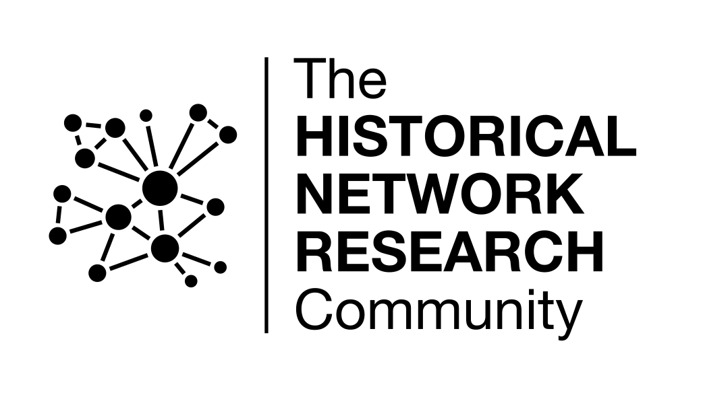

## HNR2024

The 9th International Historical Network Research Conference (HNR2024) will take place on **July 8-10 2024** at the [University of Lausanne (UNIL)](https://www.unil.ch/central/en/home.html), Switzerland.

The [call for papers](/lausanne/cfp) will be available in autumn 2023. The conference will comprise one day of workshops and two days of sessions and keynotes. While some of the content will be available online via streaming, the conference will take place in the form of a traditional in-person event, held in English. The [program](/lausanne/program) and registration will be available in spring 2024.

We look forward to meeting you in Lausanne!

   
